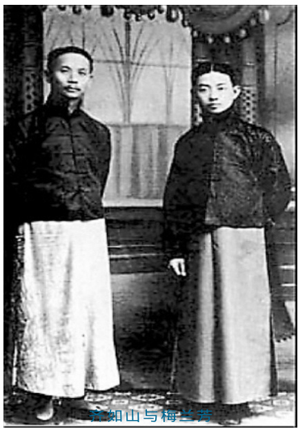

# 国剧大师齐如山（上）  

□ 梁 燕  

齐如山是中国近现代京剧史上一位杰出的理论家、剧作家、导演和活动家。他的伟大贡献首先体现在发现、培养、成就了一代京剧大家梅兰芳，并亲历和推动了京剧艺术的辉煌。他的重要贡献还体现在成功运作了中国京剧的首次访美演出，对中国传统文化艺术的海外传播具有开拓之功，对今日中国文化走出去仍有积极的借鉴价值。他最令人瞩目的贡献是以毕生之力完成的几百万字的剧学著作，构建起了京剧表演艺术的理论体系 。 学界认为 ， 齐如山是以做百科全书的气 魄来进行京剧舞台艺术理论的建设的。  

!!!!!!!!!!!!!" ! 缘起 《 汾河湾 》 辅梅创新剧 !  

民国元年，齐如山在友人的怂恿下无意中看了一出梅兰芳、谭鑫培合演的《汾河湾》。梅兰芳饰演的柳迎春，按照传统的演法，当谭鑫培饰演的薛仁贵在窑外以大段唱  

腔述说往事 时，他端坐在窑内，脸朝里面休息 ， 对于薛 仁贵所唱的内容没有任何相应的表情、动作。他对梅兰芳的演法感到不满，便写去一封长信。在信中他为梅兰芳  

  

分析女主人公柳迎春当时的心理活动：“有一个人说他是自己分别十八年的丈夫回来，自己虽不信，当然看着也有点像，所以才命他述说身世，意思那个人说来听着对便认，倘说的不对是有罪的。在这个时候，那个人说了半天，自己无动于衷，且毫无关心注意，有是理乎？” 接着他针对男主人公薛仁贵的一大段唱词进行逐一研究，并为梅兰芳设计了一系列与之相配合的动作。从专业意义上讲，齐如山在这里已经初步采用了现代戏剧导演所运用的“行动分析方法”，这封信也可以看做是一份导演剖析。它对梅兰芳的表演产生了积极的影响。  

青年梅兰芳优越的天赋条件和从谏如流的态度，大大激发了齐如山对京剧的改革热情，在之后两年多的时间里，他始终关注梅兰芳的演出，几乎是每戏必看，每次看后必去一信，讨论梅兰芳在表演上的得失。这样的交流持续了两年之久，这些带有指导意义的信函也成为了齐、梅订交的重要基础。  

1914 年春天，梅兰芳发出邀请，约齐如山来家中一叙。从此齐如山成为了梅宅的座上宾 。 齐如山也深深感到梅兰芳的温和与谦 逊，遂决意助其成功。  

为了支持梅兰芳在艺术上的精进，1915年的中秋节齐如山精心创编了一出神话歌舞戏《嫦娥奔月》，他一开始就确立了这出戏的演出原则：一要高洁雅净；二要以歌舞见长；三要“特创一件古装，乃从前及现在戏班中都没有的”。力求在演出效果上别开生面，令观众耳目一新。  

京剧中传统的青衣一行向来在表演上只重唱工，不重身段。早期的青衣演员往往是双手置于腹前，站在台上做大段演唱，形象呆板，所谓“抱肚子” 青衣。齐如山要求梅兰芳在 《 嫦娥奔月 》 中的表演突破以往的范 式，体现“唱做并重、歌舞合一” 的特点，他重点设计了嫦娥的身段动作。经过认真研究，反复琢磨，齐如山从汉赋、唐诗中描绘舞姿的词句里，从宋代的《德寿宫舞谱》等古籍上找到古代各类舞式的名称，设计出第十场“采花” 中唱【原板】时的“花镰舞”和第十三场“思凡” 中唱【南梆子】时的“袖舞”。这两场戏的歌舞表演是此剧的精华所在。在排练过程中，他亲自穿上有水袖的褶子为梅兰芳示范。  
为了塑造观众心目中的嫦娥的形象，齐如山与梅兰芳共同切磋，在服装设计上参考古代仕女画中仕女的服饰，一改戏曲传统服装衣长裙短的格局 ， 将上衣减短 ， 裙子加长 ， “裙腰靠上，用小银钩盘于胸间”，以突出仙女体态的袅娜、轻盈。在发式的设计上，改变了戏曲传统发式“大头” 的造型，创制了梳于头顶的“吕字髻”，更加贴近了古代仕女云鬟高髻的姿容。这样，嫦娥的舞台造型是：头梳吕字髻 ， 上面右插一支玉钗 ， 左戴一朵 翠花 。 身穿淡红色短袄 ， 下系白色长裙 ， 腰 间缀以丝带、玉佩。一个清丽脱俗的嫦娥形象首次出现在1915 年的京剧舞台上。  

1915 年10 月31 日，《嫦娥奔月》在吉祥园举行首演，演出大获成功。齐如山在编剧、导演方面的艺术韬略和才华得到了充分的展示，也赢得了梅兰芳等一批梨园界人士的信任。  

自此，齐、梅二人的合作便一发不可收拾。在以后的十几年里，由齐如山执笔创作、改编并导演、梅兰芳主演的剧目有《黛玉葬花》、《晴雯撕扇》、《春秋配》、《天女散花》、《木兰从军》、《童女斩蛇》、《麻姑献寿》、《红线盗盒》、《天河配》、《三娘教子》、《游龙戏凤》、《上元夫人》、《霸王别姬》、《西施》、《洛神》、《廉锦枫》、《太真外传》、《俊袭人》、《凤还巢》、《宇宙锋》、《春灯谜》、《生死恨》等。在这些剧目中，齐、梅从情节、结构、歌舞、音乐、服装、化妆、道具、布景各个方面做了一系列的改革、创新，开辟了被誉为“第二传统”的“古装新戏”。这些戏以其清新、典雅、唯美、抒情的舞台风格形成了梅派的一批经典作品。  

1924 年印度诗人泰戈尔访问中国，5 月19 日梅兰芳在开明戏院为他演出了专场《洛神 》， 泰戈尔看完演出后欣然题诗一首赠给梅 兰芳。多年以后，梅兰芳请精通孟加拉文的吴晓铃、石真教授将原诗译作汉文白话体诗：  

亲爱的，你用我不懂的  

语言的面纱  

遮盖着你的容颜；正像那遥望如同一脉  

缥缈的云霞 被水雾笼罩着的峰峦。  

透过语言和文化的障碍，泰戈尔以诗人的敏感和学者的睿智，敏锐地领悟到了齐如山在此剧中所营造的那种朦胧、诗意、唯美的意境。作为主演者，梅兰芳也由于一系列新剧的上演，获得了国内的甚至是国际的声誉。  

齐如山所做的这一切 “ 圈内 ”  有些人是 知之甚详的。1928 年4 月15 日，北平《晨报》星期画刊第129 号刊登了剧作家罗瘿公创作的一首《俳歌调齐如山》：“齐郎四十未为老，歌曲并能穷奥妙；结想常为古美人，赋容恨不工颦笑。可怜齐郎好身段，垂手回身斗轻软 。 自惜临风杨柳腰 ， 终惭映日芙蓉 面 。 颏下 鬑鬑 颇有髭 ， 难为天女与麻姑 。 恰 借梅郎好颜色 ， 尽将舞态上氍毹 ； 梅郎妙舞 人争羡，苦心指授无人见。他年法乳看传衣，弟子程郎天下艳 。 北方已再得倾城 ， 晚有芬 芳播玉京 ； 舞衣又藉齐郎授 ， 共道前贤畏后 生。双秀门前好桃李，曹穆善才那有此？奇福真堪傲世人，封万户侯宁足比；潜光必发待我诗，送尔声名日千里。”  

齐如山同梅兰芳一起创造性地将这些古典舞蹈运用于古装新戏中，他们在《嫦娥奔月》中创造了“花镰舞”、“ 水袖舞”，在《黛玉葬花》中创造了“花锄舞”，在《天女散花》中创造了“绶舞”，在《上元夫人》中创造了“拂尘舞”，在《麻姑献寿》中创造了“杯盘舞”，在《千金一笑》中创造了“扑萤舞”，在《廉锦枫》中创造了“刺蚌舞”，在《西施》中创造了“羽舞”，在《霸王别姬》中创造了“剑舞” ……这些舞蹈极大地丰富和提升了京剧旦角艺术的表现力，美化了京剧旦角的舞台形象，对于梅派艺术的成熟、对于京剧走向辉煌都起到了重要的作用。  
!!!!!!!!!! 筹划访美路 助梅流芳名 !  

20 世纪30 年代，梅兰芳历时半年的访美演出令西方人对中国的民族艺术刮目相看，并且自此充满敬慕之情。此次演出的缘起，最初是来自当时的美国公使芮恩施（PaulReinsch）在一次外交场合的谈话。此前，留美同学会在外交部曾请他观看梅兰芳表演的《嫦娥奔月》，他对梅兰芳的艺术大为赞赏，还曾特地到梅兰芳家拜访。他说：“若欲中美国民感情益加亲善，最好是请梅兰芳往美国去一次，并且表演他的艺术，让美国人看看，必得良好的结果。” 此话令当时在座的一些中国官员颇感意外，交通总长叶恭绰（玉虎）将此话告诉了齐如山，引起了齐如山的极大兴趣。于是，他便与梅兰芳等人商定，“决议要把这件事情办成”。  

在促成梅兰芳赴美演出的具体操作上，齐如山重点是从经费的筹集、剧院的落实、宣传的准备和演出的安排几个方面入手的。  

1. 经费的筹集 齐如山为此多方奔走 ， 四 处筹款。1929 年春天，齐如山求助于当时的教育界官员李石曾，希望他能玉成此事。于是，由李石曾出面邀请了周作民、钱新之等一些银行界人士和司徒雷登作为董事，以创办戏剧学校的名义在北平、上海二地分别进行资金的筹措，当北平的五万美元款项顺利筹得时，美国方面传来坏消息，由于金融危机 ， 物价上涨 ， 十万美元的经费不足敷用赴 美之行。紧急之中，上海方面在冯幼伟的鼎力支持下，银行界共筹得十余万美元的款项，最终促成此事。  

2.剧院的落实梅兰芳赴美演出的剧院也是齐如山筹划工作的一个重点，他先后拜访了美国使馆商务参赞安诺尔、美国公使马克谟和司徒雷登，通过他们联系了美国的多家剧院。为避免流于商业性的演出，他提出了以文化交流为宗旨的几项条件：  

（1）剧场主人须以礼相聘，须用极优的礼貌对待梅君；（2）须给梅君自由辍演权；（3）剧场的身份，须够高尚；（4）剧场不要太大，因为恐怕不容易满座；（5）剧场主人，不可抱完全营业的性质。  

由于有着这些不可迁就的规定，美国许多商业气味十足的剧院对此望而却步。经过种种波折，在司徒雷登的引荐下，齐如山通过电报，结识了纽约著名的剧作家哈布钦斯（Hapkins），并向其说明了梅兰芳赴美演出的意图。哈布钦斯当即表示：“梅君到美国来，可以在我的剧场演出！只要能够沟通两国的文化，我就心满意足了。至于金钱一层，我是满不在乎的。” 之后，齐如山又与哈布钦斯通讯几十次，商讨、确定了演出方案。尽管梅兰芳赴美后并没有在哈布钦斯的剧场里演出，但哈布钦斯的允诺使中方赴美演出的计划得以实现。  

3.宣传的准备在宣传上，齐如山主要通过两种途径为梅兰芳赴美演出作了先期准备工作：一是通过在美国的部分官员和商人以及留学生，联系美国的新闻媒体，向他们提供有关梅兰芳和中国戏剧的资料，让更多的美国人了解梅兰芳。二是赴美之前，齐如山花费了相当多的时间和精力，用于宣传品的编撰、制作、翻译等，约为六项：  

（1）编写《中国剧之组织》一书。（2）与黄秋岳编写《梅兰芳的历史》。后因经费窘迫，只好将《中国剧之组织》与《梅兰芳的历史》合为一册，压缩删减，取名为《梅兰芳》，交付商务印书馆印刷。（3）编印《梅兰芳歌曲谱》。（4）编写各种戏剧说明书。（5）编写几十篇讲话稿、百余篇新闻稿，绘制二百余幅戏剧图片。（6）专门准备了用于赠送外国人的礼品：瓷器、笔墨、绣货、扇子、象牙品等约几十种。  

4.演出的安排在剧目的遴选上，齐如山参考了外国人、在外留学生和来华的外国人对中国戏剧的观感、意见，甚至通过“问卷调查” 的方式，选取了受大多数人欢迎的一些剧目。随后他又根据大家的意见，考虑美国人的欣赏习惯，确定出进一步遴选的原则：  
“时间不要太久，每晚顶多不得过两个钟头，并且要演三出：头一出必要梅君，末一出也须梅君，中间加别人一出。这样办法，一则梅君不至于太累，二来使观众眼光一新，更可以引起兴味来！” 确定之后，又征求了熟悉美国文化的专家张彭春的意见，增加了《刺虎》一剧，因为该剧人物的表情丰富，便于外国观众理解；将每晚的三出戏改为四出，使内容富于变化；但限于时间，只好将剧情压缩，突出剧中的舞蹈表演。  

在服装、乐器的制做和舞台样式的设计、剧场的布置上，齐如山、张彭春等人主张力求体现中国气派。演出服装的面料全部采用纯粹的丝绸 、 锦缎并饰以手工绣花 ， “ 花样 也采取中国旧式的，一点也没有用现代化的时髦花样，像那玻璃棍、假钻石等等更在摈弃之列了。这样，一则保持中国国粹，二则中国人虽然看着外国的化学制造装饰品新鲜，而外国人却深爱中国的绸缎绣货 ”。 乐器 （ 如 堂鼓、小鼓、唢呐、胡琴等）采用了仿古的形式，所有材料都要以象牙、牛角、黄杨、紫檀等构成，还专门请人特别制做了忽雷、琵琶、阮、咸等古典乐器，演奏时不仅十分悦耳动听，而且外观非常精美典雅。乐器的盒子用楠木做成中国式的囊盒，配上红色锦缎里子 ； 行头 、 盔头的箱子 ， 用榆木板片和 牛皮包裹，朱红描金，光彩夺目。  

舞台样式仿照故宫戏台的规模 ， 台前设 立两根圆柱，上挂一副对联，联曰：  

四方王会夙具威仪五千年文物雍容茂启元音辉此日  

三世伶官早扬俊采九万里舟轺历聘全凭雅乐畅宗风  

舞台两边装饰龙头挂穗，富丽堂皇。由于美国剧场的舞台普遍宽大，所以台上的桌椅是特制的，可以根据不同的需要任意放大或者缩小。舞台的格局是：第一层保留原有剧场的旧幕，第二层是中国的红缎幕布，第三层是中国戏台式的外檐、龙柱，第四层是天花板式的垂檐，第五层是中国古典式的四对宫灯，第六层是中国传统的戏台，包括隔扇、门帘、台帐，两旁的隔扇镂刻窗眼，覆以薄纱。乐队位于隔扇之后，后台光线很暗，乐师对台上演员的一切举动都看得十分清楚，而台下观众却看不到乐队。剧场门口悬挂一百多个红色灯笼、几十幅图画、各种旗帜，一切都采取中国样式。还为乐队人员、剧场服务人员定做了中式的服装 ， 意欲给前来观 剧的美国人以鲜明的“中国” 印象。  

梅兰芳在美国各地的演出取得了空前的成功，引起了美国学术界的高度重视，哥伦比亚大学、普林斯顿大学、芝加哥大学、旧金山大学、波摩那大学、南加州大学、夏威夷大学等高校的校长、教授公会、知名的学者专家 、 纷纷邀请梅兰芳座谈 、 演说 。 波摩 那大学和南加州大学特别向梅兰芳授予该校文学博士荣誉学位，以表彰他在戏剧领域所取得的卓越成就 。 此事表面观之 ， 是梅兰芳 赴美之行的一个意外收获；而细察之，则与齐如山出国前的策划、运作有关。齐如山认为梅兰芳在美国能够取得巨大成功，主要是得到了学术界的推崇。他说：“我们没出国时，就没有用商业的形式与任何方面交涉，有很多事情都是由燕京大学司徒雷登校长替我们接洽。司徒校长认识的自然是学界中人多，因为一起头就是由学者的提倡介绍，所以社会上就明白梅君是一个大艺术家，是来沟通两国文化的国民大使；不是一个普通演戏的，不是为做买卖而赚钱来的。社会上有了这个观念，梅君的声价，自然高了许多。所以学界更是特别注意。” 事实上，齐如山在这方面做了许多工作。齐如山与司徒雷登私交甚笃，梅兰芳赴美演出的经费最初是由司徒雷登筹划的。齐如山的好友司徒宽又与波摩那大学校长有着亲密的师生关系，经司徒雷登校长的先期引荐和司徒宽的当面联络，两位校长对梅兰芳的到来表现出极高的热情，他们通过司徒宽、齐如山向梅兰芳表达了校方意见，梅兰芳表示欣然接受。次日，梅兰芳在美国获得荣誉博士学位的消息及其致词饱载于当地的各大报刊 ， 评论界皆谓之谈吐 得体，文雅谦逊，却少有人知晓梅兰芳身后的这位重要“推手” ——齐如山。  

（作者系北京外国语大学教授）（本文责编：小夏）  
