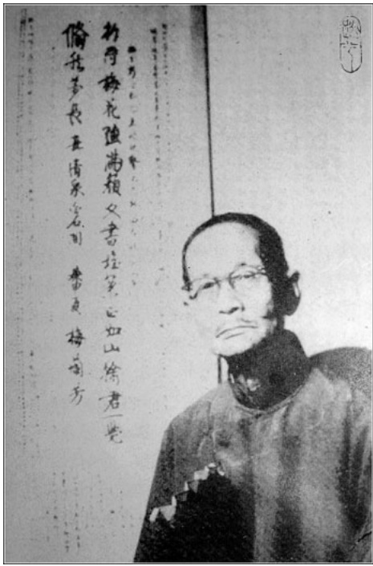
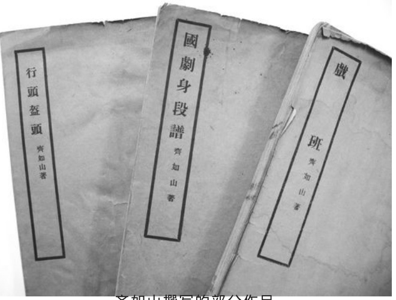

# 国剧大师齐如山（下）  

□ 梁 燕  

  

" !!!!!!!!!!! " ! 谱煌煌巨著 树一代宗师 ! !!!!!!!!!!! "  

齐如山一生致力于中国京剧的理论建设，从二十世纪十年代至六十年代，他完成了几百万字的剧学著作，涉及京剧的表演、创作、舞台美术、剧团管理、剧目和演员的评论及文献资料等诸多方面，他的“有声必歌、无动不舞” 的著名论断，他的“不许真物器上台，不许写实” 的写意观，他的创作论、技法论、观众论等理论创获，使他在二十世纪京剧理论的建设中站到了时代的前沿。本世纪初叶有学者认为，齐如山是以做百科全书的气魄来进行京剧舞台艺术理论的建设的。  

# （一）齐如山的歌舞论  

歌舞论是齐如山剧学理论中最有价值的部分，他把戏曲的本质特征概括为“有声必歌，无动不舞”。王国维早在1902 年所著的《戏曲考原》中就对戏曲的本质特征作过这样的定义：“戏曲者，谓以歌舞演故事也。” 然而王国维并未进一步论述戏曲歌舞的表现形态和艺术特征。齐如山的提法在王国维的基础上又迈出了一步，突出了戏曲歌舞性特征的本质内涵。  

“有声必歌，无动不舞” 的观点，在齐如山的早期戏曲论著中已经略见端倪，出版于1928 年的《中国剧之组织》，已对戏曲的发声和动作进行了详细的归类，并进一步说明：“中国剧乃由古时歌舞嬗变而来，故可以‘歌舞’ 二字概之。出场后一切举动者皆为舞，一切开口发声者皆为歌。” 真正形成“有声必歌，无动不舞” 这八个字，是在《国剧的原则》一书中。以后在《国剧艺术汇考》（1961 年）、《五十年来的国剧》（1962 年）等著作中，又得到更加充分的丰富和论证。他还将戏曲中的所有发声和动作分为不同的等级、类别并加以科学的论述。  

关于发声，他分为四个等级的歌唱：凡有音乐伴奏的纯粹歌唱，归为一级歌唱；凡有韵调的念诵如念引子、念诗、念对联等，归为二级歌唱；剧中一切话白，因其有快慢、有气势、有顿挫、有韵味，而归为三级歌唱；剧中所有由哭、笑、嗔、怒、忧、愁、悔、恨，以至咳嗽而发出的声音，因其不同于生活真实而归为四级歌唱 。 在四级歌唱里 ， 齐 如山把各种哭法、笑法、咳嗽法，按照人物身份、性格、音乐、场合的不同，罗列了几十种，甚至百余种。以往有关戏曲音乐的论著，似乎还没有把“歌唱” 的含义，扩大到齐如山这样大的范围。  
关于动作，齐如山潜心研究了大量古代戏曲论著，他发现“关于研究戏中动作之书，可以说一本也没有”。他又访问了梨园界的许多人，结果令人失望，原来“戏界之学戏，就是只教技术，不管理论”。的确，中国古代戏曲论著绝大部分是剧论、曲论和唱论，没有一部是专论戏曲表演动作的。  

齐如山于1932 年写了一部论述戏曲表演动作的专著，名曰《国剧身段谱》，这是一部集京剧表演大成的谱式性著作。他认为演员在动态中的各个部位的身段，只要在节律之中，都是舞蹈。就连剧中人物的髯须，各脚也能“利用此长须作出许多舞的姿式来，以表现喜怒哀乐，种种情感”。因而，他提出了这样的观点：“戏界都名之曰身段，即是舞的原理。” 这部戏曲身段谱按照生、旦、净、丑各行角色在表演上的不同，记述了京剧舞台最基本的256 种形体动作。  

齐如山将戏曲的舞蹈分为“形容人物心思意志之舞 ”、 “ 形容做事之舞 ”、 “ 形容词 句意义之舞” 三种类型，是比较科学的，具有较强的概括性和较广的涵盖面，戏曲舞蹈也不外乎以上三种类型。齐如山之所以能构成他的剧学的理论系统，得力于他善于对理论对象作出适当的分类，条分缕析地结构理论框架。“理论的发展，常常有赖于理论对象的类型，并受到它的局限。对象说明理论，理论应用于对象。” 齐如山能对理论对象（舞蹈动作）作出分类，其本身就提出了一种理论，是用对象帮助理论，用“对象说明理论”。  

# （二）齐如山的写意论  

齐如山在 《 国剧要略 》 谈到国剧特别 “要紧的地方” 就是：“万不可以看写实剧的眼光，来批评国剧，因为写实剧好的地方，在国剧中都要不得；反之，在国剧中好的地方，在写实剧中都要不得。” 他在《国剧艺术汇考》索性就用“不许真物器上台，不许写实” 两句话来总结戏曲的写意性特征，认为戏曲在舞台表演、舞台美术、舞台时空上从来都是采用“避免写实” 的艺术手段来进行创作的。  

第一，齐如山论述了“发声” 的写意特征——“一切的声音，都不许像真，都有特别规定”。他以“笑” 声为例，对各种角色行当的不同笑法，以及他（她）们的笑声所应体现的性格特点，都进行了详尽的分析。比如：老生的笑法“须要坚永或庄穆”，其声音“要长而沉静”；青衣的笑法“必须贞而婉”，其声音“须细而长”，而且“大部分声音由鼻中出来”；武生的笑法“必须要坚而脆”，其声音“要挺拔、抑扬有顿挫”；小生的笑法“青年文雅或英挺秀健”，其声音“必须柔而练，或清而脆”；丑角的笑法“不规则或幽默”，其声音“必须要騃而谐，或冷而隽”。这些不同的笑法、笑声，与生活真实存在着一定的距离，但是它们经过了艺术的加工和提炼，又能体现出生活的某些本质 。 “ 不许像真 ” 是对戏曲表演艺术中用声音塑造人物形象的美学概括，是对戏曲艺术传神、写意的创作精神的科学总结。  

第二，齐如山论述了“动作” 的写意特征——“一切动作，都不许像真，不许离开舞的意义”。他以走路的步法、骑马的上法、水袖的甩法和手指的指法为例，说明戏曲舞台的原则，并且每一种动作程式都能体现出角色的性格特点 。 比如走路的步法 ， 净角讲 “阔大”，示其“粗鲁”；生角讲“稳静安适”，以示其“庄重”；旦角讲“细稳轻倩”，以示其“袅娜” ……凡此种种，都是为了讲求动作的美观，讲求动作的节奏，避免像真，避免写实。在观众眼中，处处都是舞式，事事皆有身段，所谓“无动不舞”。戏曲舞蹈通过对生活动作的夸张、变形，以鲜明突出的外部造型来概括反映生活现象和人物精神，达到“离形得似” 的艺术效果。  

第三，齐如山论述了服装的写意特征——“不分朝代，不分地带，不分时季”。他说：“国剧中的服装，离写实太远，可以说是由唐宋元明数朝衣服斟酌制成的 ， 也可 以说是凭空制造的。” 戏曲服装中的“蟒”、“ 帔 ”、 “ 褶子 ”、 “ 氅 ”、 “ 靠 ”、 “ 宫衣 ” 等，是在古人生活服装的基础上，融入了各个时期创作者的主观情志和艺术思考而设计制作的，它没有南北地域的差别，也没有春夏秋冬的区别，甚至没有各个朝代的分别，有的却是等级之分、品德之分、性格之分。其颜色、花纹及着法有着极严的规定，例如“ 有功的正直人穿红色 ， 忠荩之臣穿绿色 ， 粗 鲁人穿黑色” 等等，这些服装的穿戴规制已经成为演员和观众之间达成共识的艺术语汇，它传达出来的是对人物性格、品质的审美评判，因此它是具有一定的写意性的。  
第四，齐如山论述了脸谱的写意特征──“传神的气味”。齐如山认为脸谱“是由像真的化妆又进一步为美术的化妆了”，他在上世纪二十年代所写的《中国剧之组织》中专门分析了脸谱的写意性，“扮演某种神怪，则将某种形象涂绘于脸上，其不能涂绘者，则将一二物事，画于脸上，以作代表。” 以极大的变形、夸张、装饰来达到传神之旨，满足观众对历史人物的伦理评判。  

第五，齐如山论述了“切末” 的写意特征——“舞具”。他在《国剧要略》中对道具和切末的概念进行了界定，认为道具是写实剧中所用的器具，与日常生活中的物品并无两样；而中国戏曲中的切末“乃完全是为歌舞应用的器具，性质完全不同，都有特别的规定，以不妨害舞的姿式为原则，绝对不许真的物器上台”。他列举了多种戏曲舞台是常用的切末：布城、山石片、云片、马鞭、船桨、大帐子、小帐子、车旗、风旗、水旗、令箭、牙笏、灯、枷等等，通过分门别类的介绍说明，分析其鲜明的写意性特征。中国戏曲舞台上的切末不同生活中的真实形态，它吸收了生活中的某种具有代表性的东西，突破细节真实的“形似”，达到艺术真实的“神似”，在似与不似之间、真与不真之间，找到最佳的传情达意的方式。  

第六，齐如山还指出了戏曲舞台时空处理的写意性特征——“流动的场子”。关于舞台，齐如山说：“国剧的场子，与话剧不同。话剧一般大多数是一个固定的地方，国  

剧则大多数是流动的场子，无法布景。” 与写实主义戏剧演出艺术不同的是，戏曲不掩盖舞台的假定性，而是公开承认并充分利用这种假定性 ， 用虚拟的手法描摹客观事物与环 境。戏曲这种时空自由的特征，不仅充分发挥了舞台空间的表现力 ， 而且使写人与写景 在人物的活动中同步完成。  

齐如山的戏曲写意论，包括声音的写意、动作的写意 、 服装的写意 、 化妆的写意 、 舞 台设计的写意和时空的写意，涉及了戏曲舞台艺术的各个方面。他的论述有些分散，不够集中，但往往一语破的，切中要害。他常常在耐心的介绍、讲解中，闪烁着真知灼见的理论光芒；在平静的叙述、分析中，显示出平中见奇的理论魅力。齐如山的写意论，并没有站在很高的理论层次上对中国戏曲作出精深的美学阐发，而是实实在在地探究舞台艺术的各个方面应该进行如何具体的写意性实践；它不着眼于形而上的“道”，而注目于形而下的“器”；它不是思辨的抽象，而是经验的实在。  

# （三）齐如山的创作论  

齐如山有关编剧方面的理著述不算很多，他以实用为目的，在继承前人成果的基础上，总结自己多年创作实践的宝贵经验，著有《编剧回忆》，他的编剧理论集中体现了如下观点：  

1.高度重视剧本的结构。齐如山说：“ 编皮簧剧须明瞭他的结  

  

齐如山撰写的部分作品  
构。” 在场次的具体安排上，齐如山提到末场要“收煞有力”，“要达到最高潮、最热闹的地步，然后再一落千丈”。对于结局的处理不落俗套的观点和区别对待不同素材的写作方法，是他在创作上取得成功的关键。  

# 2.高度重视观众心理  

齐如山在剧本创作中有着充分的观众意 识，在《编剧回忆》中，他特别提出了“编剧需迎合观众” 的看法。他认为剧作家应运用一切办法抓住观众。对此，他总结了“非多在反面着笔不可” 的方法：运用反衬，通过对比，形成心理落差，取得较好的剧场效果。考虑中国观众的审美习惯，齐如山提出“戏中要有幽默处以便舒畅观众之脑思” 的观点。  

# 3.高度重视戏曲语言  

齐如山在《编剧回忆》中提出了“戏中词句最好雅俗共赏” 的看法，而且认为戏曲的一般语言应用“戏中恒用” 之语，剧中人物的语言应符合人物的身份、教养。对于剧中运用典故的问题，齐如山认为用典可以不拘朝代的先后，突出戏曲的写意性特征。  

# 4.高度重视演员的表演  

齐如山在 《 编剧回忆 》 中谈到在剧本创 作时，应考虑将演员的表演纳入构思的范围。他说：“当编某一句时，则必须闭目想一想，台上该脚说此一句时，他是怎样的神气？怎样的举动？甚至其他别的脚色都是怎样？如此编出来，则此句方有着落，更容易有精彩。” 这种“身代梨园” 的舞台意识是是他在创作上取得成功的关键 。  

（四）齐如山的技法论  

1935 年，齐如山出版了《上下场》、《国剧身段谱》等，专门总结京剧舞台动作技法。  

齐如山在 《 上下场 》 里罗列了多种京剧 舞台上下场的动作技法，还归纳了舞台调度、京剧音乐在上下场时的多种技法。这些京剧舞台技术方面的提示，是经过齐如山多年在梨园界访谈、印证而来，它从艺人的口传心授阶段走向了文本化、规范化，使京剧舞台表演从此有章可循、有据可依。  

员形体动作的谱式性的专著，它考证了唐宋舞蹈与京剧舞台动作之间的渊源关系，详细诠释了当代京剧舞台汇聚的种种动作要领。  

梅兰芳对此书给予了高度的评价：  

高阳齐如山先生，研求剧学已三十余年，梨园中老辈暨至后生无不熟稔，识力既高，又能虚心，逢人必问，故一切规矩知之极深，若纹之在掌。昔年与余谈曰：中国剧之精华，全在乎表情、身段及各种动作之姿势。歌舞合一，矩矱森严，此一点实超乎世界任何戏剧组织法之上。余深服其言。二十年间，余所表演之身段姿式，受先生匡正处亦复不少。近又将各种身段之原则，一一写出，实为从来谈剧著述中之创举，我侪同业旧辈咸视为极重要之发明，深信国剧不至失传，将惟此是赖。  

京剧自徽班进京之时，经过几十年的孕育，于二十世纪二三十年代形成了群星璀璨的鼎盛态势。在以后的几十年间，也曾一度风靡全国，拥有“国粹” 之称，蜚声海外。但是到了二十一世纪的今天，京剧显现出了令人无奈的颓势和荒凉。究其原因，笔者以为，其核心问题是人才的匮乏，包括编剧、导演 、 表演 、 音乐 、 美术人才的匮乏 ， 也包 括懂专业、善经营的管理人才。须知，在京剧辉煌鼎盛的时代，每一位“名角儿” 的成功，在其身后都有一个创作集体或名曰“智囊团” 的队伍，其中最重要的一点就是各行人才的通力合作，有见识、有眼光的文化人热心参与其中，这才是形成四大名旦、四大须生竞相争妍的基础和实力所在。曾几何时，梅、尚、程、荀背后的齐如山、罗瘿公、金仲荪、庄清逸、陈墨香等文人，以其独特的方式对他们所心仪的艺术家们给予文化的注入，他们的学识和眼光让四大名旦在二十世纪的京剧舞台上留下了炫目的足迹。齐如山以他贯通中西的学养和对京剧的满腔热忱以及个人传奇般的经历，似乎可给今人留下一些历史的思索。  

（作者系北京外国语大学教授）  

《国剧身段谱》是集中体现京剧舞台演  
